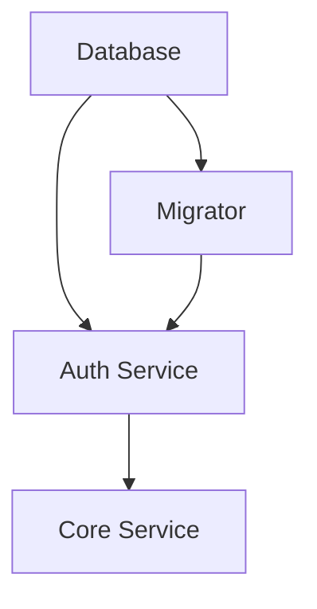

# Конфигурация Healthcheck

Этот документ описывает настройки проверки состояния (healthcheck) сервисов в Docker Compose.

## Обзор

Система использует healthcheck для обеспечения правильного порядка запуска сервисов и мониторинга их состояния.

## Конфигурация сервисов

### Database (PostgreSQL)
- **Метод**: `pg_isready` команда
- **Интервал**: каждые 5 секунд
- **Таймаут**: 5 секунд
- **Повторы**: 5 попыток
- **Endpoint**: внутренняя проверка PostgreSQL

### Auth Service
- **Метод**: HTTP запрос к `/health` endpoint
- **Порт**: 8081 (отдельный порт для healthcheck)
- **Интервал**: каждые 10 секунд
- **Таймаут**: 5 секунд
- **Повторы**: 5 попыток
- **Период запуска**: 30 секунд (время на инициализацию)
- **Endpoint**: `http://localhost:8081/health`

### Core Service
- **Метод**: HTTP запрос к `/health` endpoint
- **Порт**: 8080 (основной порт сервиса)
- **Интервал**: каждые 10 секунд
- **Таймаут**: 5 секунд
- **Повторы**: 5 попыток
- **Период запуска**: 30 секунд
- **Endpoint**: `http://localhost:8080/health`

## Зависимости запуска



1. **Database** запускается первым
2. **Migrator** ждет готовности базы данных
3. **Auth Service** ждет готовности базы данных и завершения миграций
4. **Core Service** ждет готовности всех предыдущих сервисов

## Health Endpoints

### Auth Service: `/health`
```json
{
  "status": "ok",
  "service": "auth-service",
  "timestamp": "2025-01-01T12:00:00Z"
}
```

### Core Service: `/health`
```json
{
  "status": "ok",
  "service": "core-service",
  "timestamp": "2025-01-01T12:00:00Z"
}
```

## Мониторинг

### Проверка состояния сервисов
```bash
# Проверить состояние всех сервисов
docker-compose ps

# Проверить healthcheck конкретного сервиса
docker inspect --format='{{json .State.Health}}' subs_auth_service

# Посмотреть логи healthcheck
docker logs subs_auth_service
```

### Ручная проверка endpoints
```bash
# Auth service
curl http://localhost:8081/health

# Core service
curl http://localhost:8080/health
```

## Troubleshooting

### Общие проблемы

1. **Сервис не проходит healthcheck**
   - Проверьте логи: `docker logs <container_name>`
   - Убедитесь, что сервис полностью инициализирован
   - Проверьте доступность endpoint'а

2. **Зависимости не запускаются в правильном порядке**
   - Убедитесь, что healthcheck настроен правильно
   - Проверьте `depends_on` конфигурацию в docker-compose.yaml

3. **Таймауты healthcheck**
   - Увеличьте `start_period` для медленно запускающихся сервисов
   - Проверьте производительность системы

### Параметры настройки

- **interval**: как часто выполняется проверка
- **timeout**: максимальное время ожидания ответа
- **retries**: количество неудачных попыток перед пометкой как unhealthy
- **start_period**: время ожидания перед началом healthcheck

## Безопасность

- Health endpoints не требуют аутентификации
- Возвращают минимальную информацию о состоянии
- Используют отдельный порт для auth-service (изоляция от основного gRPC порта)